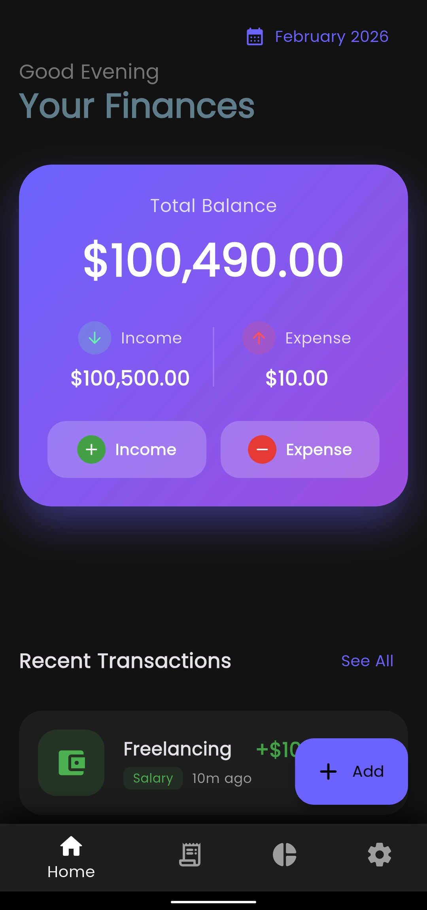
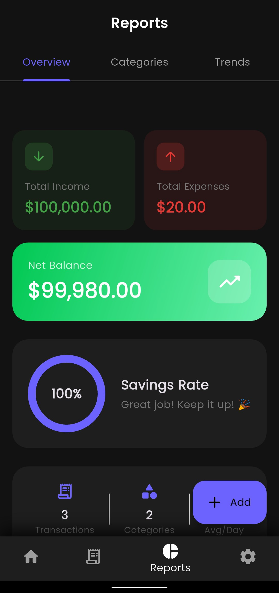
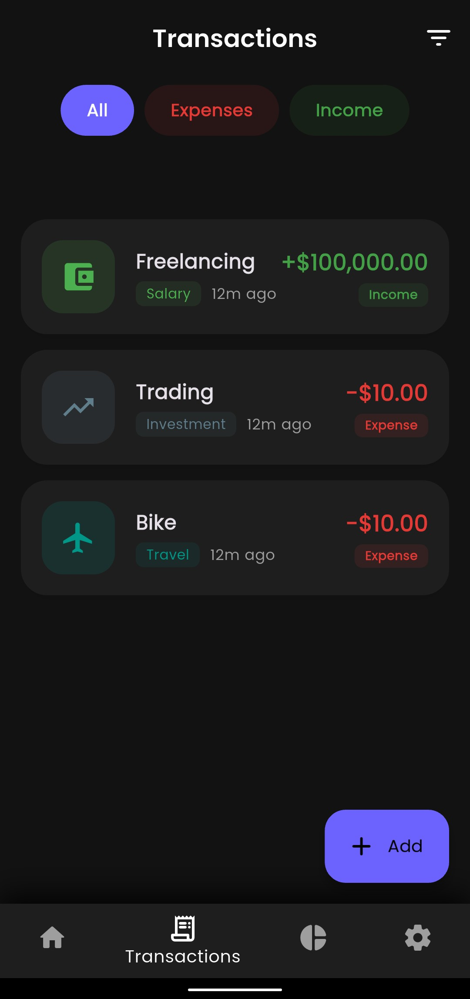

# 📊 Offline Expense Tracker

A simple, clean, and **fully offline expense tracking app** that helps you take control of your money 💸  
Track your **income and expenses date-wise**, visualize spending habits, and stay financially organized — all without an internet connection.

---

## 📸 Screenshots

| Dashboard & Tracking | Category Insights | Transaction History |
|:--------------------:|:-----------------:|:-------------------:|
|  |  |  |

---

## ✨ Features

### 🧾 Track Income & Expenses
- Add **income** and **expense** entries separately  
- Organize transactions **date-wise**
- View your full transaction history anytime

### 🗂️ Categories Included
Easily categorize your money for better insights:
- 🍔 Food  
- 🚗 Transportation  
- 🛍️ Shopping  
- 🎮 Entertainment  
- 💡 Bills  
- 🏥 Healthcare  
- 🎓 Education  
- ✈️ Travel  
- 🛒 Groceries  
- 🧍 Personal  
- 🎁 Gifts  
- 💼 Salary  
- 📈 Investments  

(You can choose the category while adding a transaction.)

### ✏️ Manage Transactions
- 🔍 View transaction details
- ✏️ Edit existing entries
- 🗑️ Delete transactions you no longer need

### 📈 Visual Insights
- 🥧 **Pie Chart** to see category-wise spending
- 📊 **Per-category breakdown**
- 📉 **Spending trends** to understand where your money goes over time

### 🔒 100% Offline
- No login
- No internet required
- Your data stays **on your device**

---

## 🎯 Why Offline Expense Tracker?

✔ Lightweight & fast  
✔ No ads, no tracking  
✔ Perfect for daily budgeting  
✔ Ideal for students, professionals, and anyone who wants control over their finances  

---

## 🛠️ Use Cases
- Track daily expenses  
- Monitor monthly spending  
- Identify overspending categories  
- Plan savings better  

---

## 🚀 Future Enhancements (Planned)
- Custom categories  
- Monthly/weekly reports  
- Data export (CSV / PDF)  
- Backup & restore  

---

## 🤝 Contributing
Contributions are welcome!  
If you have ideas, bug fixes, or improvements, feel free to open an issue or submit a pull request.

---

## 📄 License
This project is licensed under the **MIT License**.

---

### 💡 Take control of your money — one expense at a time.